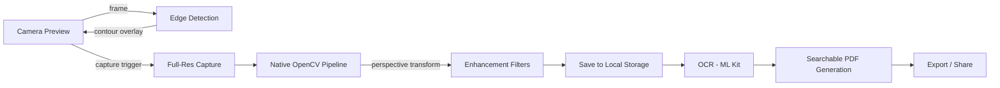

# Architecture Design — ScanFlow

## Architectural Pattern

**Clean Architecture + Feature-First Modularization**

Four layers with strict dependency direction: UI → Application → Domain → Data/Native.

```
┌─────────────────────────────────────────────────┐
│                  Presentation                   │
│         Widgets · Screens · GoRouter            │
├─────────────────────────────────────────────────┤
│                  Application                    │
│    Riverpod Providers · Use Cases · ViewModels  │
├─────────────────────────────────────────────────┤
│                    Domain                       │
│       Entities · Repositories (abstract)        │
├─────────────────────────────────────────────────┤
│                     Data                        │
│  Drift DB · File System · Platform Channels     │
└─────────────────────────────────────────────────┘
         │                       │
    ┌────┴────┐           ┌──────┴──────┐
    │ Android │           │     iOS     │
    │ Kotlin  │           │   Swift     │
    │ CameraX │           │AVFoundation │
    │ OpenCV  │           │  OpenCV     │
    └─────────┘           └─────────────┘
```

## Layer Responsibilities

| Layer | Responsibility | Allowed Dependencies |
|---|---|---|
| **Presentation** | UI rendering, user input, navigation | Application layer only |
| **Application** | Orchestration, state, business logic coordination | Domain layer only |
| **Domain** | Entities, abstract repo interfaces, value objects | None (pure Dart) |
| **Data** | DB access, file I/O, platform channel calls | Domain layer (implements interfaces) |

## Dependency Rule

Inner layers never import outer layers. The Domain layer has **zero** Flutter/package dependencies.

## Native Bridge Architecture

```
Flutter (Dart)
    │
    ├── MethodChannel: 'com.scanflow/camera'
    │       → CameraX (Android) / AVFoundation (iOS)
    │
    ├── MethodChannel: 'com.scanflow/opencv'
    │       → OpenCV C++ via JNI (Android) / via bridging header (iOS)
    │
    └── EventChannel: 'com.scanflow/camera_stream'
            → Live frame streaming for real-time edge detection
```

### Why MethodChannel over FFI?

| Approach | Pros | Cons |
|---|---|---|
| **MethodChannel** | Simple, proven, handles lifecycle | Serialization overhead per call |
| **dart:ffi** | Zero-copy, lowest latency | Complex memory management, no lifecycle hooks |
| **Platform Views** | Embeds native views | Heavy, janky on older devices |

**Decision**: MethodChannel for camera control + command-style processing. EventChannel for frame streaming. Consider FFI only if serialization becomes a measured bottleneck (>5ms per frame).

## Data Flow — Complete Scan Pipeline



## Isolate Strategy

Heavy processing runs off the main thread:

| Operation | Strategy |
|---|---|
| Edge detection (live) | Native thread via EventChannel |
| Perspective transform | Native thread via MethodChannel |
| Image enhancement | Dart Isolate or native thread |
| OCR | ML Kit runs on its own thread |
| PDF generation | Dart Isolate |
| Thumbnail generation | Dart Isolate |

## Error Boundary Design

Each layer handles its own failures and translates them into domain-level results:

```dart
// Domain layer — pure result type
sealed class Result<T> {
  const Result();
}
class Success<T> extends Result<T> {
  final T data;
  const Success(this.data);
}
class Failure<T> extends Result<T> {
  final AppError error;
  const Failure(this.error);
}
```

Native errors (camera disconnection, OpenCV crashes) are caught at the Data layer and wrapped into `AppError` types before surfacing.

## Key Architectural Decisions

| Decision | Rationale |
|---|---|
| Feature-first folders over layer-first | Scales better; each feature is self-contained |
| Riverpod over BLoC | Less boilerplate, built-in DI, async-native |
| Drift over raw SQLite | Type-safe queries, migration support, code-gen |
| OpenCV via native, not dart bindings | Stability with high-res images, access to full API |
| Offline-first, no auth | Privacy-focused, zero backend dependency for MVP |
