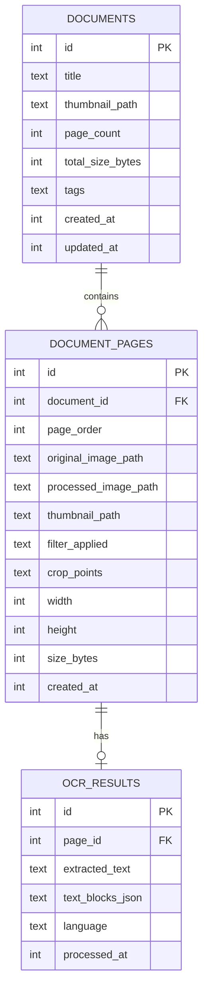

# Database Schema — Drift/SQLite

## Entity Relationship Diagram



## Drift Table Definitions

```dart
// tables.dart

class Documents extends Table {
  IntColumn get id => integer().autoIncrement()();
  TextColumn get title => text().withLength(min: 1, max: 255)();
  TextColumn get thumbnailPath => text().nullable()();
  IntColumn get pageCount => integer().withDefault(const Constant(0))();
  IntColumn get totalSizeBytes => integer().withDefault(const Constant(0))();
  TextColumn get tags => text().withDefault(const Constant(''))(); // comma-separated
  IntColumn get createdAt => integer()(); // Unix epoch ms
  IntColumn get updatedAt => integer()(); // Unix epoch ms
}

class DocumentPages extends Table {
  IntColumn get id => integer().autoIncrement()();
  IntColumn get documentId => integer().references(Documents, #id)();
  IntColumn get pageOrder => integer()();
  TextColumn get originalImagePath => text()();
  TextColumn get processedImagePath => text().nullable()();
  TextColumn get thumbnailPath => text().nullable()();
  TextColumn get filterApplied => text().withDefault(const Constant('none'))();
  TextColumn get cropPoints => text().nullable()(); // JSON: [x1,y1,x2,y2,x3,y3,x4,y4]
  IntColumn get width => integer()();
  IntColumn get height => integer()();
  IntColumn get sizeBytes => integer()();
  IntColumn get createdAt => integer()();
}

class OcrResults extends Table {
  IntColumn get id => integer().autoIncrement()();
  IntColumn get pageId => integer().references(DocumentPages, #id)();
  TextColumn get extractedText => text()();
  TextColumn get textBlocksJson => text()(); // JSON array of positioned text blocks
  TextColumn get language => text().withDefault(const Constant('en'))();
  IntColumn get processedAt => integer()();
}
```

## Database Class

```dart
@DriftDatabase(tables: [Documents, DocumentPages, OcrResults])
class AppDatabase extends _$AppDatabase {
  AppDatabase(super.e);

  @override
  int get schemaVersion => 1;

  @override
  MigrationStrategy get migration => MigrationStrategy(
    onCreate: (m) => m.createAll(),
    onUpgrade: (m, from, to) async {
      // Stepwise migrations when schema changes
    },
  );
}
```

## File Storage Layout

```
app_documents/                     # getApplicationDocumentsDirectory()
├── scans/
│   ├── {document_id}/
│   │   ├── original/
│   │   │   ├── page_001.jpg
│   │   │   └── page_002.jpg
│   │   ├── processed/
│   │   │   ├── page_001.jpg
│   │   │   └── page_002.jpg
│   │   ├── thumbnails/
│   │   │   ├── page_001_thumb.jpg
│   │   │   └── doc_thumb.jpg
│   │   └── exports/
│   │       └── document.pdf
│   └── ...
└── temp/                          # Cleared on app start
    └── capture_buffer/
```

## Key Design Decisions

| Decision | Rationale |
|---|---|
| Unix epoch `int` for timestamps | Simpler than TEXT dates, faster comparison, no timezone issues |
| `crop_points` as JSON string | Four-corner coordinates change per edit; no need for separate table |
| `text_blocks_json` as JSON | ML Kit returns positioned blocks; relational model is overkill |
| `tags` as comma-separated | V1 simplicity; migrate to junction table if tag features grow |
| Separate `original` / `processed` paths | Non-destructive editing — user can always re-process from original |

## Indexing

```dart
// Add to table definitions
@override
List<Set<Column>> get uniqueKeys => [];

// Custom indices via migration
await customStatement('CREATE INDEX idx_documents_updated ON documents(updated_at DESC)');
await customStatement('CREATE INDEX idx_pages_document ON document_pages(document_id, page_order)');
await customStatement('CREATE INDEX idx_ocr_page ON ocr_results(page_id)');
await customStatement('CREATE INDEX idx_ocr_text ON ocr_results(extracted_text)'); // FTS later
```

## Query Patterns

| Query | Purpose | Expected Frequency |
|---|---|---|
| `SELECT * FROM documents ORDER BY updated_at DESC` | Home screen list | Every home visit |
| `SELECT * FROM document_pages WHERE document_id = ? ORDER BY page_order` | Document detail | On document open |
| `SELECT extracted_text FROM ocr_results WHERE page_id IN (...)` | Text search | On search |
| `UPDATE document_pages SET page_order = ? WHERE id = ?` | Page reorder | On drag-drop |
| `DELETE FROM documents WHERE id = ?` | Delete doc (cascade pages + OCR) | User action |
