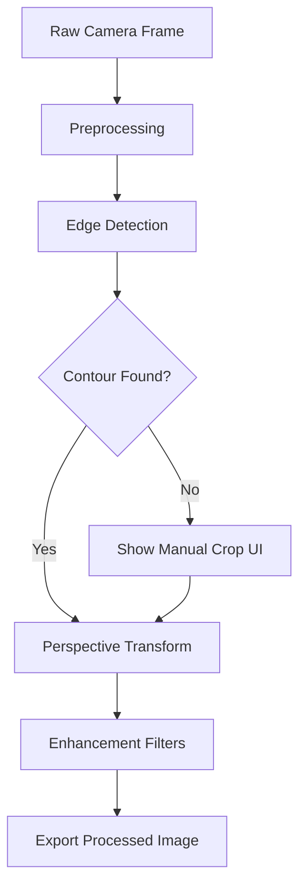

# Image Processing Pipeline — OpenCV Native

## Pipeline Overview



## Stage 1: Preprocessing

**Input**: Raw JPEG/YUV frame from camera
**Output**: Grayscale, denoised Mat

```
Original Image
→ cvtColor(BGR2GRAY)
→ GaussianBlur(5x5, σ=1.0)
→ medianBlur(5)          // salt-and-pepper noise removal
```

**Parameters**:
| Param | Value | Tuning Note |
|---|---|---|
| Gaussian kernel | 5×5 | Increase for noisier cameras |
| Gaussian sigma | 1.0 | Higher = more blur |
| Median kernel | 5 | Must be odd |

## Stage 2: Edge Detection

**Strategy**: Canny + morphological closing

```
Preprocessed Grayscale
→ Canny(threshold1=50, threshold2=150)
→ dilate(kernel=3x3, iterations=2)
→ morphologyEx(CLOSE, kernel=5x5)
```

**Adaptive thresholds**: Compute Canny thresholds from image median:
```
median = np.median(gray_image)
lower = max(0, 0.67 * median)
upper = min(255, 1.33 * median)
```

## Stage 3: Contour Detection

```
Edge Map
→ findContours(RETR_EXTERNAL, CHAIN_APPROX_SIMPLE)
→ filter by area (> 20% of image area)
→ approxPolyDP(epsilon = 0.02 * arcLength)
→ select largest 4-point polygon
```

**Validation criteria**:
- Exactly 4 vertices after approximation
- Area > 20% of total image area
- All angles between 60°–120° (reject skewed quads)
- Convex hull check

**Fallback**: If no valid quad found → return `EdgeDetectionResult.notFound` → UI shows manual crop handles.

## Stage 4: Perspective Transform

```
4 Corner Points (sorted: TL, TR, BR, BL)
→ compute output dimensions from max width/height of quad
→ getPerspectiveTransform(src_pts, dst_pts)
→ warpPerspective(image, M, output_size)
```

**Corner sorting algorithm**:
1. Sort by sum (x+y): smallest = top-left, largest = bottom-right
2. Sort by difference (y-x): smallest = top-right, largest = bottom-left

## Stage 5: Enhancement Filters

| Filter | OpenCV Operations | Use Case |
|---|---|---|
| **Original** | No-op | User wants color |
| **Grayscale** | `cvtColor(BGR2GRAY)` | Clean B&W docs |
| **B&W (Magic)** | `adaptiveThreshold(GAUSSIAN, blockSize=21, C=10)` | High-contrast text |
| **Sharpen Text** | `GaussianBlur` → `addWeighted(original, 1.5, blur, -0.5)` | Crisp text edges |
| **Shadow Removal** | `dilate(7x7)` → `medianBlur(21)` → `absdiff` → `normalize` | Uneven lighting |

### Shadow Removal Detail

```
original
→ dilate(kernel=7x7)           // estimate background
→ medianBlur(21)               // smooth background estimate
→ result = absdiff(gray, bg)   // subtract background
→ normalize(0, 255)            // stretch histogram
→ optional: threshold          // final cleanup
```

## Native API Contract

### MethodChannel: `com.scanflow/opencv`

| Method | Args | Returns |
|---|---|---|
| `detectEdges` | `{imagePath: String, previewScale: double}` | `{found: bool, points: List<double>}` |
| `perspectiveTransform` | `{imagePath: String, points: List<double>, outputPath: String}` | `{success: bool, outputPath: String}` |
| `applyFilter` | `{imagePath: String, filter: String, outputPath: String}` | `{success: bool, outputPath: String}` |
| `processFullPipeline` | `{imagePath: String, points: List<double>?, filter: String, outputPath: String}` | `{success: bool, outputPath: String}` |

### EventChannel: `com.scanflow/edge_stream`

Streams edge detection results for live preview overlay:
```dart
// Emits every ~100ms during camera preview
{
  "found": true,
  "points": [x1, y1, x2, y2, x3, y3, x4, y4], // normalized 0-1
  "confidence": 0.87
}
```

## Memory Management

| Concern | Strategy |
|---|---|
| Large image buffers | Process at max 2048px on longest edge; scale down first |
| Mat lifecycle | Release native Mats immediately after use (`mat.release()`) |
| Concurrent processing | Max 1 image pipeline at a time; queue additional requests |
| Preview frames | Process every 3rd frame for edge detection (throttle) |
| Temp files | Delete intermediate files after pipeline completes |

## Performance Targets (from SRS)

| Operation | Target | Strategy |
|---|---|---|
| Edge detection (live) | < 30ms/frame | Native thread, downscaled preview |
| Full pipeline | < 2 sec | Native thread, parallel I/O |
| Filter application | < 500ms | Native processing at output resolution |
