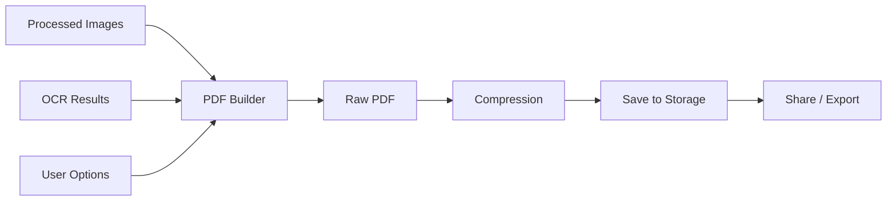

# PDF Generation Design

## Architecture



## Package Selection

| Package | Role |
|---|---|
| `pdf` (dart) | PDF document generation |
| `printing` (dart) | Share/print integration |

Both are pure Dart — no native code needed.

## PDF Builder Interface

```dart
abstract class PdfGenerator {
  Future<File> generatePdf(PdfOptions options);
}

class PdfOptions {
  final List<PdfPageInput> pages;
  final PdfPageSize pageSize;         // A4, Letter, Auto (fit to image)
  final PdfQuality quality;           // low, medium, high
  final bool embedOcrText;
  final String title;
  final String? author;
}

class PdfPageInput {
  final String processedImagePath;
  final int pageOrder;
  final OcrResult? ocrResult;         // nullable if OCR not run
}

enum PdfPageSize { a4, letter, auto }
enum PdfQuality { low, medium, high }
```

## Implementation

```dart
class PdfGeneratorImpl implements PdfGenerator {
  @override
  Future<File> generatePdf(PdfOptions options) async {
    final pdf = pw.Document(
      title: options.title,
      author: options.author,
      creator: 'ScanFlow',
    );

    for (final pageInput in options.pages) {
      final imageBytes = await File(pageInput.processedImagePath).readAsBytes();
      final image = pw.MemoryImage(imageBytes);

      final pageFormat = _resolvePageFormat(options.pageSize, image);

      pdf.addPage(
        pw.Page(
          pageFormat: pageFormat,
          margin: pw.EdgeInsets.zero,
          build: (context) {
            return pw.Stack(
              children: [
                // Layer 1: Full-page image
                pw.Positioned.fill(child: pw.Image(image, fit: pw.BoxFit.contain)),
                // Layer 2: Invisible OCR text (if available)
                if (options.embedOcrText && pageInput.ocrResult != null)
                  ..._buildOcrTextLayer(pageInput.ocrResult!, context.page),
              ],
            );
          },
        ),
      );
    }

    final outputPath = await _getOutputPath(options.title);
    final file = File(outputPath);
    await file.writeAsBytes(await pdf.save());
    return file;
  }
}
```

## Searchable PDF — OCR Text Layer

Each OCR text block is positioned as an invisible text element over the image:

```dart
List<pw.Widget> _buildOcrTextLayer(OcrResult ocr, PdfPage page) {
  return ocr.blocks.map((block) {
    return pw.Positioned(
      left: block.boundingBox.left * page.width,
      top: block.boundingBox.top * page.height,
      width: block.boundingBox.width * page.width,
      height: block.boundingBox.height * page.height,
      child: pw.Text(
        block.text,
        style: pw.TextStyle(
          fontSize: 1,           // tiny, invisible
          color: PdfColors.transparent,  // fully transparent — for selection only
        ),
      ),
    );
  }).toList();
}
```

This makes PDFs searchable in any PDF viewer (Ctrl+F, Spotlight, etc.) without visible text.

## Compression Strategy

| Quality | JPEG Quality | Max Dimension | Typical File Size/Page |
|---|---|---|---|
| High | 95% | Original | ~1-3 MB |
| Medium | 75% | 2048px | ~300-600 KB |
| Low | 50% | 1536px | ~100-250 KB |

Compression is applied to images **before** embedding in PDF:

```dart
Future<Uint8List> compressForPdf(String imagePath, PdfQuality quality) async {
  // Run in isolate to avoid jank
  return compute(_compressImage, CompressArgs(imagePath, quality));
}
```

## Page Reordering

Pages are reorderable via drag-and-drop in the UI. The `pageOrder` field in `PdfPageInput` determines final PDF page sequence.

```dart
// Reorder updates only the in-memory list; DB is updated on save
void reorderPages(int oldIndex, int newIndex) {
  final pages = [...state.pages];
  final item = pages.removeAt(oldIndex);
  pages.insert(newIndex, item);
  state = state.copyWith(pages: pages);
}
```

## Export / Share

```dart
// Share via OS share sheet
await Printing.sharePdf(
  bytes: pdfBytes,
  filename: '${document.title}.pdf',
);

// Print
await Printing.layoutPdf(onLayout: (_) => pdfBytes);
```

## Performance Target

| Metric | Target |
|---|---|
| PDF export (10 pages, medium quality) | < 5 sec |
| Compression per page | < 300ms |
| Total memory during generation | < 100MB peak |

Strategy: Process pages sequentially (not all in memory at once), dispose images after embedding.
