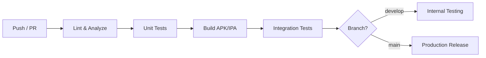

# CI/CD — GitHub Actions

## Pipeline Architecture



## Workflow Files

### 1. CI — On Every PR

```yaml
# .github/workflows/ci.yml
name: CI
on:
  pull_request:
    branches: [main, develop]

jobs:
  analyze:
    runs-on: ubuntu-latest
    steps:
      - uses: actions/checkout@v4
      - uses: subosito/flutter-action@v2
        with:
          flutter-version: '3.29.0'
          channel: 'stable'
      - run: flutter pub get
      - run: dart run build_runner build --delete-conflicting-outputs
      - run: flutter analyze --fatal-infos
      - run: dart format --set-exit-if-changed lib/ test/

  test:
    runs-on: ubuntu-latest
    needs: analyze
    steps:
      - uses: actions/checkout@v4
      - uses: subosito/flutter-action@v2
        with:
          flutter-version: '3.29.0'
      - run: flutter pub get
      - run: dart run build_runner build --delete-conflicting-outputs
      - run: flutter test --coverage --reporter=github
      - name: Check coverage threshold
        run: |
          sudo apt-get install lcov -y
          lcov --summary coverage/lcov.info

  build-android:
    runs-on: ubuntu-latest
    needs: test
    steps:
      - uses: actions/checkout@v4
      - uses: actions/setup-java@v4
        with:
          distribution: 'temurin'
          java-version: '17'
      - uses: subosito/flutter-action@v2
        with:
          flutter-version: '3.29.0'
      - run: flutter pub get
      - run: dart run build_runner build --delete-conflicting-outputs
      - run: flutter build apk --debug
      - uses: actions/upload-artifact@v4
        with:
          name: debug-apk
          path: build/app/outputs/flutter-apk/app-debug.apk

  build-ios:
    runs-on: macos-latest
    needs: test
    steps:
      - uses: actions/checkout@v4
      - uses: subosito/flutter-action@v2
        with:
          flutter-version: '3.29.0'
      - run: flutter pub get
      - run: dart run build_runner build --delete-conflicting-outputs
      - run: flutter build ios --no-codesign
```

### 2. Deploy — On Merge to Develop

```yaml
# .github/workflows/deploy-beta.yml
name: Deploy Beta
on:
  push:
    branches: [develop]

jobs:
  deploy-android:
    runs-on: ubuntu-latest
    steps:
      - uses: actions/checkout@v4
      - uses: actions/setup-java@v4
        with:
          distribution: 'temurin'
          java-version: '17'
      - uses: subosito/flutter-action@v2
        with:
          flutter-version: '3.29.0'

      - name: Decode keystore
        run: echo "${{ secrets.ANDROID_KEYSTORE_BASE64 }}" | base64 -d > android/app/keystore.jks

      - run: flutter pub get
      - run: dart run build_runner build --delete-conflicting-outputs
      - run: flutter build appbundle --release
        env:
          KEYSTORE_PASSWORD: ${{ secrets.KEYSTORE_PASSWORD }}
          KEY_ALIAS: ${{ secrets.KEY_ALIAS }}
          KEY_PASSWORD: ${{ secrets.KEY_PASSWORD }}

      - name: Upload to Play Store Internal
        uses: r0adkll/upload-google-play@v1
        with:
          serviceAccountJsonPlainText: ${{ secrets.PLAY_SERVICE_ACCOUNT }}
          packageName: com.scanflow.app
          releaseFiles: build/app/outputs/bundle/release/app-release.aab
          track: internal

  deploy-ios:
    runs-on: macos-latest
    steps:
      - uses: actions/checkout@v4
      - uses: subosito/flutter-action@v2
        with:
          flutter-version: '3.29.0'
      - run: flutter pub get
      - run: dart run build_runner build --delete-conflicting-outputs
      - run: flutter build ipa --export-options-plist=ios/ExportOptions.plist
      - name: Upload to TestFlight
        uses: apple-actions/upload-testflight-build@v3
        with:
          app-path: build/ios/ipa/*.ipa
          issuer-id: ${{ secrets.APPSTORE_ISSUER_ID }}
          api-key-id: ${{ secrets.APPSTORE_KEY_ID }}
          api-private-key: ${{ secrets.APPSTORE_PRIVATE_KEY }}
```

### 3. Release — On Tag

```yaml
# .github/workflows/release.yml
name: Production Release
on:
  push:
    tags:
      - 'v*'

jobs:
  release-android:
    # Same as deploy-beta but track: production
  release-ios:
    # Same as deploy-beta but to App Store (not TestFlight)
```

## Secrets Required

| Secret | Purpose |
|---|---|
| `ANDROID_KEYSTORE_BASE64` | Base64-encoded release keystore |
| `KEYSTORE_PASSWORD` | Keystore password |
| `KEY_ALIAS` | Signing key alias |
| `KEY_PASSWORD` | Key password |
| `PLAY_SERVICE_ACCOUNT` | Google Play API service account JSON |
| `APPSTORE_ISSUER_ID` | App Store Connect API issuer |
| `APPSTORE_KEY_ID` | App Store Connect API key ID |
| `APPSTORE_PRIVATE_KEY` | App Store Connect API private key |

## Branch Strategy

```
main ────────────────────────── production releases (tags)
  │
  └── develop ────────────────── beta deployments (auto)
        │
        └── feature/xxx ──────── PR → CI only
```

## Version Management

```bash
# Bump version in pubspec.yaml before tagging
# Format: major.minor.patch+buildNumber
# Build number auto-incremented in CI
flutter build --build-number=${{ github.run_number }}
```
