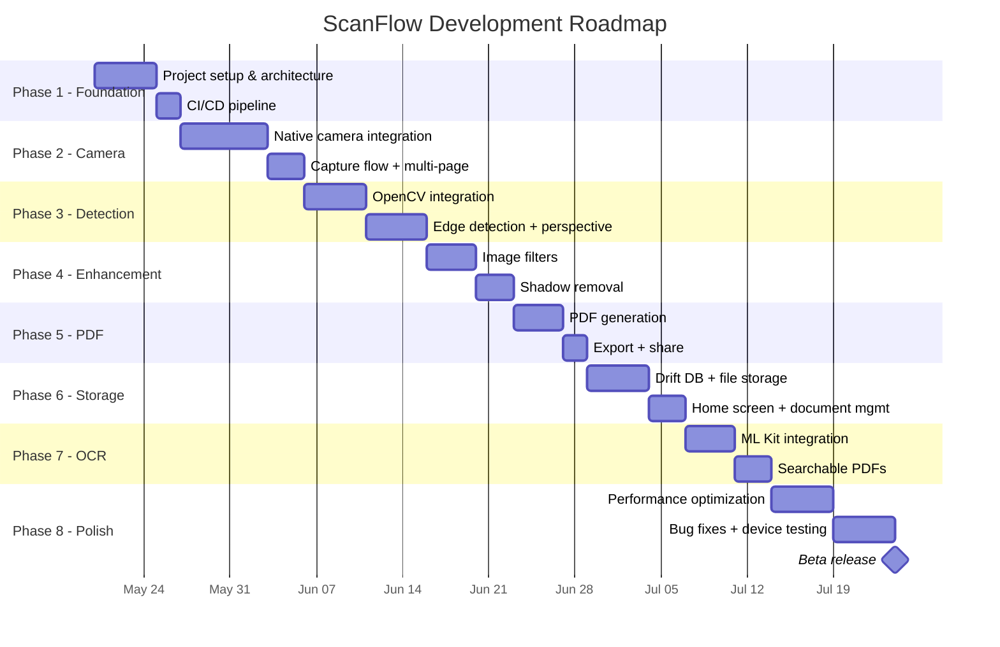

# Roadmap & Milestones — Implementation Plan

## Phase Overview

## Detailed Phase Breakdown

### Phase 1 — Foundation (Week 1)

| Task | Output | Acceptance Criteria |
|---|---|---|
| Initialize Flutter project with correct deps | `pubspec.yaml` with all deps | `flutter pub get` succeeds |
| Set up folder structure | All directories from `02_project_structure.md` | Compiles with empty implementations |
| Configure Riverpod + GoRouter | `main.dart`, `app.dart`, `app_router.dart` | App launches with placeholder home screen |
| Set up Drift database | `app_database.dart`, tables, code-gen | `build_runner` generates without error |
| Configure theme + design system | `app_theme.dart`, `app_colors.dart` | Consistent Material 3 theme |
| Set up GitHub Actions CI | `.github/workflows/ci.yml` | PR triggers lint + test + build |
| Set up Crashlytics | `firebase_options.dart` | Crash reports appear in console |

**Deliverable**: App launches on Android/iOS with empty home screen, CI green.

---

### Phase 2 — Camera (Week 2)

| Task | Output | Acceptance Criteria |
|---|---|---|
| Android CameraX plugin | `CameraPlugin.kt`, `CameraManager.kt` | Camera preview renders in Flutter |
| iOS AVFoundation plugin | `CameraPlugin.swift`, `CameraManager.swift` | Camera preview renders on iOS |
| Flutter camera screen | `camera_screen.dart` | Full-screen preview with capture button |
| Photo capture | Capture method + file save | JPEG saved to app directory |
| Flash toggle | `setFlash` channel method | Flash on/off/auto working |
| Multi-page flow | Session-based capture | Can capture 3+ pages in sequence |

**Deliverable**: User can open camera, capture multiple pages, see thumbnails.

---

### Phase 3 — Detection (Week 3-4)

| Task | Output | Acceptance Criteria |
|---|---|---|
| OpenCV Android integration | JNI bridge, `.so` libraries | OpenCV functions callable from Kotlin |
| OpenCV iOS integration | Obj-C++ bridge, framework | OpenCV functions callable from Swift |
| Edge detection | `detectEdges` channel method | Detects document edges in < 30ms |
| Live edge overlay | `EdgeOverlay` widget + EventChannel | Green contour overlaid on camera preview |
| Perspective transform | `perspectiveTransform` method | Straightened document output |
| Manual crop UI | `CropScreen` with draggable handles | User can adjust 4 corners manually |
| Fallback when no edges | Auto → manual crop transition | Graceful fallback, no crash |

**Deliverable**: Documents are auto-detected and perspective-corrected.

---

### Phase 4 — Enhancement (Week 4-5)

| Task | Output | Acceptance Criteria |
|---|---|---|
| Grayscale filter | `applyFilter('grayscale')` | Clean grayscale output |
| B&W (adaptive threshold) | `applyFilter('bw')` | High-contrast text document |
| Sharpen text | `applyFilter('sharpen')` | Visibly crisper text |
| Shadow removal | `applyFilter('shadow')` | Even lighting across page |
| Enhancement screen | `EnhancementScreen` with filter selector | User can preview + select filter |
| Before/after comparison | Swipe or toggle comparison | User sees difference |

**Deliverable**: User can enhance scanned documents with 4 filter options.

---

### Phase 5 — PDF (Week 5-6)

| Task | Output | Acceptance Criteria |
|---|---|---|
| Single-page PDF | `PdfGeneratorImpl` | Generate PDF from one page |
| Multi-page PDF | Loop pages in order | PDF with correct page count |
| Page reorder UI | Drag-and-drop list | Pages reorderable before export |
| Compression | Quality presets | High/Medium/Low size differences visible |
| Share/export | `Printing.sharePdf` | Share sheet opens with PDF |
| Print | `Printing.layoutPdf` | Print dialog opens |

**Deliverable**: User can generate, reorder, and share multi-page PDFs.

---

### Phase 6 — Storage (Week 6-7)

| Task | Output | Acceptance Criteria |
|---|---|---|
| Document CRUD | `DocumentDao`, `PageDao` | Create/read/update/delete works |
| File storage service | `FileStorageService` | Images organized in correct dirs |
| Thumbnail generation | Isolate-based thumb gen | 256px thumbs generated on save |
| Home screen | `HomeScreen` with document grid/list | Documents listed with thumbnails |
| Document detail | `DocumentDetailScreen` | View pages, metadata |
| Rename/delete | Edit/delete actions | Changes persisted |
| Search | Query by title | Filtered results |

**Deliverable**: Full document management with persistent storage.

---

### Phase 7 — OCR (Week 7-8)

| Task | Output | Acceptance Criteria |
|---|---|---|
| ML Kit integration | `MlKitOcrService` | Text extracted from test image |
| OCR on scan | Auto-OCR after enhancement | OCR result stored in DB |
| OCR result screen | `OcrResultScreen` | User can view + copy extracted text |
| Searchable PDF | Invisible text layer | Text selectable in PDF viewer |
| Text search | Search across documents | Results filtered by OCR text |

**Deliverable**: OCR works offline, PDFs are searchable.

---

### Phase 8 — Optimization & Release (Week 8-10)

| Task | Output | Acceptance Criteria |
|---|---|---|
| Startup optimization | Lazy init, splash | < 1.5s cold start |
| Memory profiling | Fix leaks, limit buffers | No OOM on 20-page scan |
| Low-end device testing | Adaptive quality | Works on 2GB RAM devices |
| Device matrix testing | Samsung/Xiaomi/Oppo/Pixel | No camera crashes on top 10 devices |
| iOS testing | iPhone SE 2 + iPhone 14 | All features work |
| Bug bash | Fix top bugs | Zero P0 bugs |
| Analytics setup | PostHog events | Events flowing |
| Beta deployment | Play Internal + TestFlight | Build available to testers |

**Deliverable**: Beta-ready app deployed to internal testers.

## Risk-Adjusted Timeline

| Scenario | Total Duration |
|---|---|
| Optimistic (no blockers) | 8 weeks |
| Realistic (minor issues) | 10 weeks |
| Pessimistic (OpenCV/camera issues) | 12 weeks |

Highest risk phases: **Phase 3 (OpenCV integration)** and **Phase 2 (Camera cross-platform)**.
